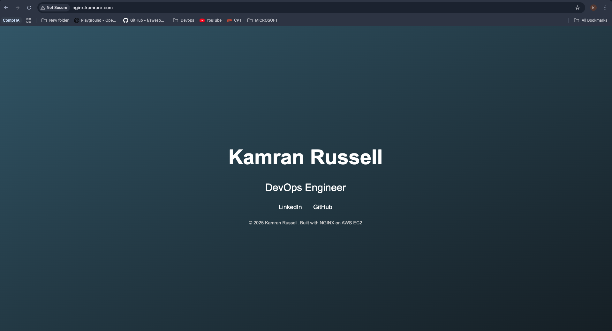

## 🚀 NGINX on AWS EC2 with a Custom Domain 
---

A step-by-step guide to launching an NGINX web server on Amazon EC2 and mapping it to a domain purchased via Cloudflare. 

By the end, your site will be live at your custom domain — powered by AWS and NGINX. 

--- 
 

##Step 1 — Buy a Domain on Cloudflare 
---

Go to Cloudflare Registrar. 

Search for a domain you like. 

Purchase it (usually £5–£10/year). 

After purchase, Cloudflare automatically manages your DNS — no extra setup yet. 

✅ You can also use AWS Route 53 if you prefer to stay inside AWS. 

--- 
 

##Step 2 — Launch an EC2 Instance 
---

Go to the AWS EC2 console. 

  - Search for EC2 in the AWS search bar → click Launch Instance. 

Basic Settings: 

  - Name: nginx-server 

  - AMI: Amazon Linux 2023 (Free Tier eligible) 

  - Instance type: t3.micro (Free Tier eligible) 

  - Key pair: Select an existing .pem key or create a new one (download it and keep it safe). 

Security Group — Add inbound rules: 

  - SSH (Port 22) — Source: My IP 

  - HTTP (Port 80) — Source: 0.0.0.0/0 

  - HTTPS (Port 443) — Source: 0.0.0.0/0 

Click Launch Instance and wait until it’s in a Running state. 

Copy Public IPv4 Address:
 
Go to your instance → Instance Summary → Copy the Public IPv4 Address (you’ll need this later). 
 
--- 

##Step 3 — Connect to the EC2 Instance via SSH 
---

Replace the placeholders below with your key path and EC2 public IP: 

`ssh -i ~/path/to/key.pem ec2-user@<EC2_PUBLIC_IP>` 

--- 
 

##Step 4 — Install & Start NGINX on EC2 
---

Run the following commands after SSH-ing in: 

`sudo yum update –y`  

`sudo yum install -y nginx`  

`sudo systemctl start nginx`  

`sudo systemctl enable nginx`  

`sudo systemctl status nginx`  # should show "active (running)"   

Test: 
Open http://<YOUR_EC2_PUBLIC_IP> in your browser — you should see the NGINX welcome page. 

--- 

##Step 5 — Point Your Domain to the EC2 IP (Cloudflare) 
---

Go to Cloudflare → Your Domain → DNS → Add record. 

Add: 

Type: A 

Name: @ (root) or nginx (for nginx.yourdomain.com) 

IPv4 Address: <EC2_PUBLIC_IP> 

TTL: Auto 

Proxy Status: DNS only (grey cloud) for initial testing 

Save. 

--- 
 
##Step 6 — Confirm DNS is Live 
---

From your local machine: 

'nslookup your.domain`  

or 

`dig +short your.domain` 

 
You should see your EC2 public IP. 

 
Visit http://(your.domain) — the default NGINX page should now appear. 

 
--- 

##🎉 Milestone Reached 
--

Your NGINX web server is live on EC2 and mapped to your custom domain. 

--- 
 

##🛠 Extra — Replace the Default Page with a Custom One 
---
 
Goal: Replace NGINX’s default page with a custom HTML landing page. 
 
Navigate to the web root and back up the default file: 
 
`cd /usr/share/nginx/html`  

`sudo cp index.html index.html.bak` 

---
 
Edit the page: 

`sudo nano index.html`  

 
Delete the default content, paste in your own HTML code for your web pages UI,save (CTRL+O, Enter) and exit (CTRL+X). 

--- 

##Reload NGINX and test: 
---
 
`sudo systemctl reload nginx ` 

Visit your domain — you should now see your custom landing page. 

  

---
If the old page still appears: 

Hard-refresh (Cmd/Ctrl + Shift + R) 

If using Cloudflare proxy, set to DNS only or purge cache.  

